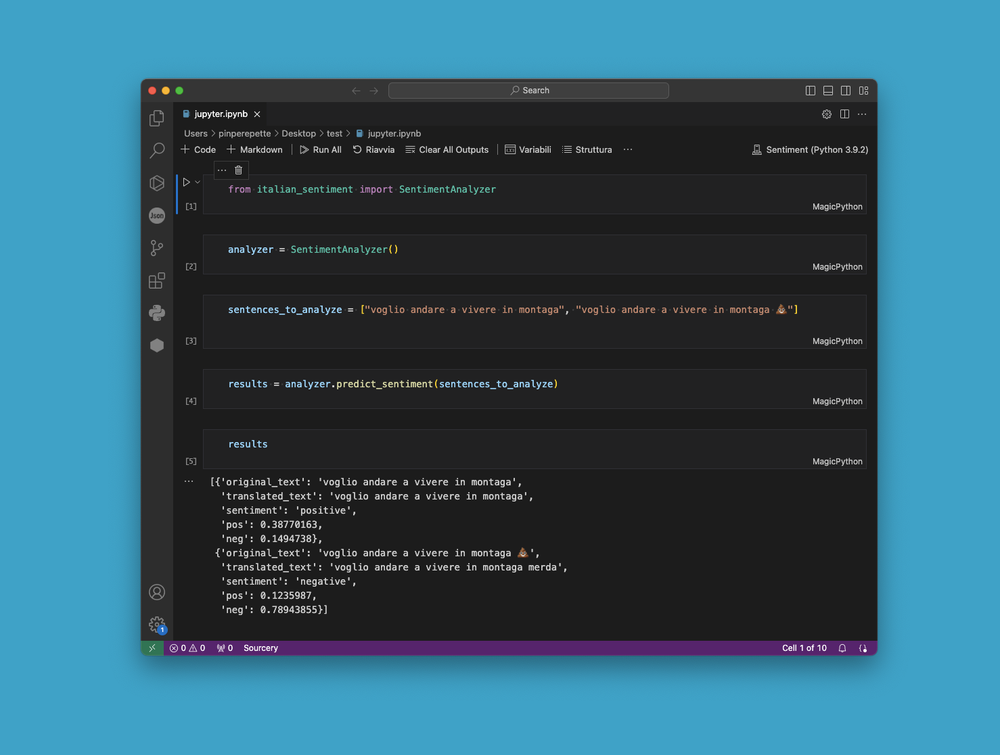

Italian Sentiment is a Python package for sentiment analysis in Italian language.

The installation process may take some time.
Here is an example of a sentiment analysis package inspired by the old SentITA

## Installation

You can install the package using `pip`:

```bash
git clone https://github.com/Pinperepette/italian_sentiment.git

cd path/to/italian_sentiment

pip install .
```

##Usage
```python
from italian_sentiment import SentimentAnalyzer

# Initialize the SentimentAnalyzer
analyzer = SentimentAnalyzer()

# Sentences to analyze
sentences_to_analyze = ["voglio andare a vivere in montagna", "voglio andare a vivere in montagna 💩"]

# Predict sentiment for each sentence
results = analyzer.predict_sentiment(sentences_to_analyze)

# Print the results
for result in results:
    print(result)
```


##License

This project is licensed under the MIT License - see the LICENSE file for details.

For more information and detailed usage instructions, please refer to the documentation.
